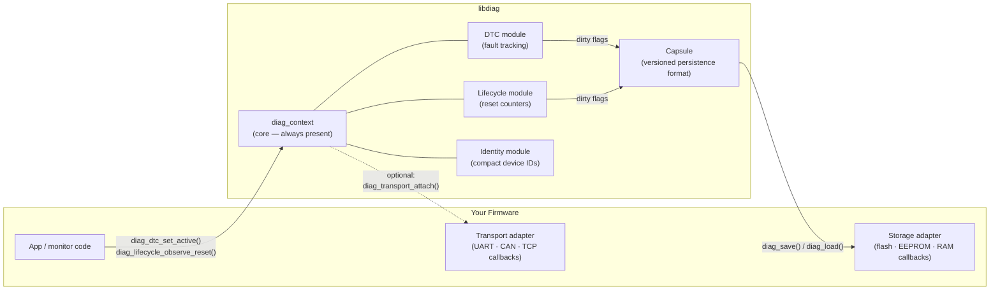

# Generic Diagnostics Library

A transport-agnostic C99 diagnostics library for constrained embedded systems.
Inspired by UDS DTC concepts, but not tied to CAN, ISO-TP, or any specific bus.

The goal is to provide a small, portable diagnostic core that embedded
applications can connect to their own:

- transport layer: CAN, UART, TCP, BLE, SPI, test harness, etc.
- storage layer: RAM, flash, EEPROM, filesystem, database, etc.
- protocol framing: project-specific binary protocol, UDS-like protocol, JSON,
  or any other command format.

> No heap. No platform locks. No hidden flash writes.  
> You control storage, transport, and timing — the library owns the state machine.

**New here?** → [5-minute onboarding guide](docs/onboarding.md)

## Architecture at a Glance

The library sits between your application logic and your platform adapters.
You provide the callbacks; the library owns the diagnostic state machine.



### Division of Labor

| You own | Library owns |
|---------|--------------|
| Platform startup and reset-reason detection | DTC fault tracking and UDS status bits |
| Storage medium (flash, EEPROM, RAM) | Capsule serialization and versioning |
| Transport medium (UART, CAN, TCP) | Diagnostic state machine and counters |
| Calling `diag_dtc_operation_cycle()` each cycle | Confirmation and aging logic |
| Sizing and allocating context + DTC array | Zero dynamic allocation |
| Framing, protocol, and service logic | Core fault records and lifecycle state |

## Branches

- `main` is intentionally empty.
- `c` contains the C99 embedded implementation.
- `cpp` is reserved for the parallel C++17 implementation.

Start on `c`:

```sh
git checkout c
```

## What You Get

- fixed-capacity DTC registration, status, counters, and operation-cycle aging
- lifecycle/reset counter policy without hidden write-on-boot behavior
- compact numeric device identity
- storage and transport adapter interfaces
- explicit capsule persistence for bootloader/application sharing
- compile-time feature switches for smaller embedded builds
- Docker/devcontainer, ASAN, Doxygen, size reports, and feature-matrix checks

## Quick Start

Clone, select the C branch, and run the full local gate:

```sh
git clone https://github.com/Mrunmoy/diagnostics.git
cd diagnostics
git checkout c
./build.py all
```

If you prefer SSH, use `git@github.com:Mrunmoy/diagnostics.git`.

Common workflows:

```sh
./build.py build
./build.py test
./build.py test --preset linux-asan
./build.py all
./build.py all --dtc-capacity 16 --write-alignment 16
./build.py feature-matrix
./build.py format --check
./build.py clean
```

`./build.py all` is the main local gate. It runs format checking, debug tests,
ASAN/UBSAN tests, release library installation, and a generated CMake package
consumption smoke test. Its size report accepts the same product-sizing options
as `./build.py size`. It also runs the feature matrix, which builds supported
feature profiles and checks disabled feature symbols are not exported from `libdiag.a`.

Pass CMake cache options after `--`:

```sh
./build.py build -- DIAG_BUILD_EXAMPLES=OFF
./build.py all -- DIAG_BUILD_EXAMPLES=OFF
```

## Pick A Feature Profile

Examples are the fastest way to choose a configuration:

```sh
cd examples
```

Start with:

- `examples/basic` for the smallest core-only integration.
- `examples/sensor_node` for RAM-only DTCs and identity.
- `examples/io_module` for identity plus transport only.
- `examples/process_controller` for confirmed persistent DTCs.
- `examples/industrial_oven` for critical DTCs plus lifecycle persistence.
- `examples/bootloader_app_shared` for separate bootloader/application banks.
- `examples/ecu_node` for a complete embedded node profile.

Each example has its own `README.md` with exact feature switches, build command,
benefits, and expected output.

Build installable library output for another CMake project:

```sh
./build.py library
```

This produces headers, `libdiag.a`, and CMake package files under
`build/install/diag`.

Build and test in Docker:

```sh
docker compose build
docker compose run --rm diagnostics-dev
```

Open in VS Code Dev Containers:

1. Install the VS Code Dev Containers extension.
2. Run `Dev Containers: Reopen in Container`.
3. Use the CMake extension, or run the tasks:
   - `CMake: build container debug`
   - `CTest: container debug`
4. Use the debug configurations:
   - `Debug diagnostics tests`
   - `Debug basic example`

Or run CMake directly inside the container or on a Linux host:

```sh
cmake --preset linux-debug
cmake --build --preset linux-debug
ctest --preset linux-debug
```

Inside the devcontainer, use the container preset:

```sh
./build.py all --preset container-debug
```

## Repository Layout

```text
.
├── cmake/                  # CMake helper modules
├── .devcontainer/          # VS Code Dev Container definition
├── .vscode/                # Build, test, and debug tasks
├── docs/                   # Single design document
├── examples/               # Example adapters and usage
├── include/diag/           # Public library API
├── src/                    # Library implementation
├── tests/                  # TDD tests
├── tools/docker/           # Docker build/test image
├── CMakeLists.txt
├── CMakePresets.json
├── docker-compose.yml
└── README.md
```

## Intended Downstream Use

Applications can consume this repository as a Git submodule and link `diag`.
Concrete storage and transport implementations should live in the consuming
project unless they are generic examples.

Example:

```text
application
├── third_party/generic-diagnostics
├── platform/my_flash_storage.c
├── platform/my_transport.c
└── app/diagnostic_protocol.c
```

As a submodule:

```cmake
add_subdirectory(third_party/generic-diagnostics)
target_link_libraries(app PRIVATE diag::diag)
```

As an installed package:

```cmake
find_package(diag CONFIG REQUIRED)
target_link_libraries(app PRIVATE diag::diag)
```

## Design Principles

- Diagnostic logic must not depend on CAN, sockets, filesystems, or RTOS APIs.
- All platform behavior is injected through small interfaces.
- Public APIs must be usable from embedded C projects.
- Dynamic allocation is not used by the core.
- All runtime capacity is caller-provided and fixed at initialization.
- Tests define behavior before implementation.
- Adapters are examples, not required dependencies.

## Branch Strategy

The repository shape is:

- `main`: intentionally empty or documentation-only landing branch.
- `c`: embedded C implementation.
- `cpp`: embedded C++ implementation.

Both implementation branches should target constrained embedded systems. The C++
branch should not assume exceptions, RTTI, heap allocation, or the full standard
library unless explicitly enabled by configuration.
