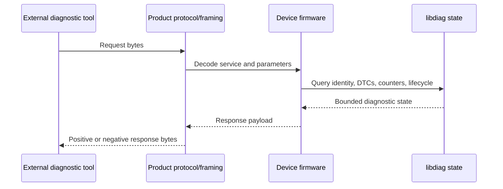
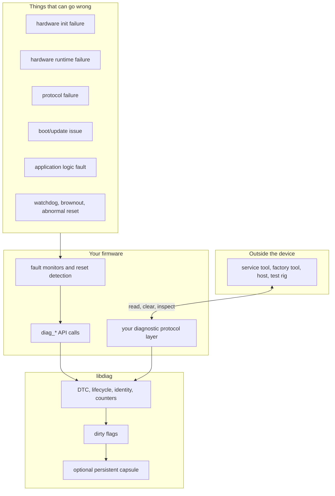
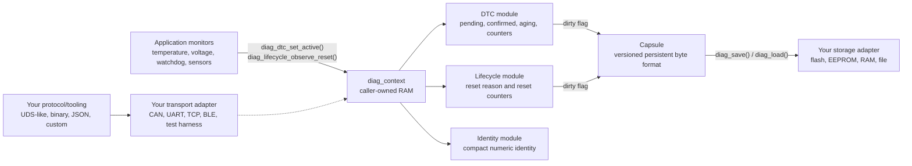

# Generic Diagnostics Library

A small C99 diagnostics core for embedded firmware that needs fault tracking,
reset history, device identity, and optional persistence without being tied to
CAN, ISO-TP, flash drivers, filesystems, or an RTOS.

This library is for products that eventually need to answer questions like:

- What fault happened, and is it still active?
- Is the fault pending, confirmed, or aging out?
- How many times did it occur or clear?
- Did the device reset abnormally?
- Which product, device type, and instance reported the problem?
- Which diagnostic state should survive a reset, and when is it safe to write it?

`libdiag` owns the diagnostic state machine. Your firmware owns the platform.
You decide how faults are detected, where bytes are stored, how messages are
framed, and when storage writes are allowed.

## Why This Exists

Many embedded projects start with a few fault flags and later grow into a mix of
runtime errors, persistent trouble codes, reset counters, service tools, and
bootloader/application handoff state. That usually becomes product-specific code
that is hard to reuse and easy to tie to one bus or storage device.

This project keeps those concerns separated:

- The core tracks DTC state, counters, operation-cycle behavior, lifecycle state,
  and compact identity.
- Storage and transport are callback interfaces supplied by the application.
- Persistence uses an explicit serialized capsule instead of raw C structures.
- Runtime memory is caller-owned and fixed at initialization.
- Feature switches remove unused modules from constrained builds.

The core avoids heap allocation, hidden flash writes, platform locks, and
protocol-specific assumptions.

## UDS In Plain English

UDS, or Unified Diagnostic Services, is the automotive diagnostic model defined
by ISO 14229. In practice, it is a request/response language that lets an
external tester ask a device what it is, what went wrong, whether faults are
current or historical, and whether certain service actions should be performed.

UDS is commonly carried over CAN with ISO-TP. The diagnostic model itself is
larger than that transport choice: service IDs, subfunctions, data identifiers,
DTCs, status bits, positive responses, and negative responses. A similar model
can be carried over CAN, Ethernet, UART, a test harness, or a product-specific
link when the framing layer supports it.

This project borrows the useful parts of that model, especially DTCs and clear
diagnostic state boundaries. The library provides the state behind a diagnostic
interface; a downstream project can expose that state through a UDS-like server,
a custom binary protocol, or a factory test tool.

### Why UDS Exists

As embedded systems became more complex, service tools needed a common way to
inspect devices without rebuilding firmware or attaching a debugger. A diagnostic
protocol solves that by giving an external tool controlled access to internal
state:

- identify the device and firmware component being queried.
- read current and historical trouble codes.
- distinguish active, pending, confirmed, and aging faults.
- clear selected diagnostic state after service.
- read counters and lifecycle information after resets.
- perform these actions through a predictable request/response contract.

That is the same need this library targets outside the automotive-only world:
debug the device from the outside when it is already built, sealed, deployed, or
running in a larger system.

### What A UDS-Style Message Looks Like

The exact bytes depend on the service, but the shape is simple. A tester sends a
service request. The device returns either a positive response or a negative
response.



Example UDS-style service frames:

| Purpose | Request shape | Positive response shape |
|---------|---------------|-------------------------|
| Read data by identifier | `0x22 DID_H DID_L` | `0x62 DID_H DID_L data...` |
| Read DTC information | `0x19 subfunction filters...` | `0x59 subfunction DTC/status...` |
| Clear diagnostic information | `0x14 group_of_dtc` | `0x54` |

Negative responses also have a recognizable form:

```text
0x7F <original_service_id> <negative_response_code>
```

For example, a request to read an unsupported identifier might return:

```text
request:  22 F1 90
response: 7F 22 31
```

That means "service 0x22 failed with response code 0x31". A protocol layer above
this library can make those choices. `libdiag` focuses on the reliable internal
state that such responses need.

### Where This Library Fits



A useful embedded diagnostics core should expose any failure the firmware can
detect:

- hardware initialization failures.
- sensor, actuator, memory, or peripheral failures.
- communication/protocol errors.
- bootloader, update, or application handoff issues.
- watchdog resets, brownouts, or unexpected reset reasons.
- application-level state machine faults.

Your firmware decides what each fault means and which faults deserve persistent
DTCs. The library makes those faults consistent, queryable, countable, clearable,
and optionally persistent.

## Mental Model

Your application monitors real conditions. When something crosses a threshold,
it reports that fact to `libdiag`. The library updates bounded RAM state and
marks persistent sections dirty when needed. Later, at a time your product
chooses, you can save the dirty state through your storage adapter.



The important boundary is this: setting a fault never writes flash. Fault paths
update RAM. Persistence happens only when your firmware calls `diag_save()`.

## What You Provide

| You provide | Why |
|-------------|-----|
| Fault monitors | Hardware limits and safety rules belong to the product. |
| Caller-owned memory | Context storage, DTC arrays, and capsule buffers are supplied by you. |
| Operation-cycle timing | You decide what a meaningful cycle means for the product. |
| Storage callbacks | Flash, EEPROM, files, RAM, and wear-leveling policy are platform concerns. |
| Transport callbacks | CAN, UART, TCP, BLE, and test harnesses all fit behind the same shape. |
| Protocol/framing layer | The library provides state that a UDS-like server or custom protocol can expose. |

## What The Library Provides

| Library surface | What it gives you |
|-----------------|-------------------|
| `diag_context` | The opaque runtime home for enabled modules. |
| DTC module | Fixed-capacity trouble codes, status bits, counters, confirmation, aging. |
| Lifecycle module | Reset reason handling and reset counter policies without write-on-boot defaults. |
| Identity module | Numeric ecosystem/product/device identity for host-side catalogs. |
| Storage module | Explicit load/save/clear adapter contract. |
| Capsule module | Versioned, CRC-protected persistence format for DTC and lifecycle sections. |
| Transport module | Minimal send/receive adapter hook for your diagnostic protocol layer. |

## First Integration

Start with RAM-only DTCs. This proves the core model without storage, transport,
or persistence:

```c
#include <diag/diag.h>

static struct diag_context_storage context_storage;
static struct diag_dtc_snapshot    dtc_records[4];

struct diag_context *ctx = NULL;
struct diag_config config = {0};

diag_init(&context_storage, &config, &ctx);

struct diag_dtc_config dtc_config = {
    .records = dtc_records,
    .capacity = 4u,
};

diag_dtc_attach(ctx, &dtc_config);
diag_dtc_register(ctx, 0x010001u, DIAG_DTC_SEVERITY_ERROR);

if (sensor_reading_is_invalid())
{
    diag_dtc_set_active(ctx, 0x010001u);
}
else
{
    diag_dtc_set_inactive(ctx, 0x010001u);
}

diag_dtc_operation_cycle(ctx);
```

That is enough to get a bounded DTC record with UDS-style status behavior and no
storage writes. Add lifecycle, identity, storage, capsule, or transport only
when the product needs them.

## Choose A Starting Example

Each example represents a product shape and an embedded tradeoff. Start with the
closest scenario:

| If your product needs... | Read this first | Why |
|--------------------------|-----------------|-----|
| A tiny link/lifetime check | `examples/basic` | Shows the smallest possible context integration. |
| A few runtime faults that reset on power cycle | `examples/sensor_node` | DTC + identity with no persistence cost. |
| Local DTC behavior only | `examples/dtc` | Focuses on registration, active state, counters, and operation cycles. |
| Reset reason/counter policy | `examples/lifecycle` | Shows reset tracking without forcing flash writes. |
| Numeric device identity only | `examples/identity` | Useful when host tooling owns names and catalogs. |
| Callback contracts | `examples/adapters` | Shows how storage and transport adapters are shaped. |
| Confirmed faults that survive restart | `examples/process_controller` | Adds capsule persistence for important confirmed state. |
| Critical thermal/reset diagnostics | `examples/industrial_oven` | Persists only important service data. |
| Separate bootloader and app diagnostics | `examples/bootloader_app_shared` | Uses separate capsule banks instead of shared raw structs. |
| A full embedded node profile | `examples/ecu_node` | Exercises identity, DTCs, lifecycle, storage, transport, and capsule. |

Each example README explains when to use that profile, what code to inspect, why
features are disabled, and what the output means.

## Quick Start

```sh
git clone https://github.com/Mrunmoy/diagnostics.git
cd diagnostics
git checkout c
./build.py all
```

If you prefer SSH, use `git@github.com:Mrunmoy/diagnostics.git`.

Useful commands:

```sh
./build.py build
./build.py test
./build.py test --preset linux-asan
./build.py all
./build.py feature-matrix
./build.py size --dtc-capacity 16 --write-alignment 16 --sections dtc,lifecycle
./build.py format --check
./build.py library
./build.py clean
```

Pass CMake options after `--`:

```sh
./build.py build -- DIAG_FEATURE_DTC=ON DIAG_FEATURE_STORAGE=OFF
```

`./build.py all` is the main local gate. It runs formatting checks, debug tests,
ASAN/UBSAN tests, release installation, package-consumption smoke tests, size
reporting, and the feature matrix.

## Docker And VS Code

Build and test in Docker:

```sh
docker compose build
docker compose run --rm diagnostics-dev
```

Inside the devcontainer, use:

```sh
./build.py all --preset container-debug
```

VS Code users can open the repository in the Dev Containers extension and use
the provided CMake, CTest, and debug configurations.

## Repository Layout

```text
.
├── cmake/                  # CMake helper modules
├── .devcontainer/          # VS Code Dev Container definition
├── .vscode/                # Build, test, and debug tasks
├── docs/design.md          # Single design source of truth
├── examples/               # Scenario-focused reference integrations
├── include/diag/           # Public C API
├── src/                    # Library implementation
├── tests/                  # GoogleTest behavior tests
├── tools/docker/           # Docker build/test image
├── CMakeLists.txt
├── CMakePresets.json
├── docker-compose.yml
└── README.md
```

## Downstream Use

Most embedded projects should consume this repository as a submodule and keep
their concrete adapters in the application tree:

```text
application
├── third_party/generic-diagnostics
├── platform/my_flash_storage.c
├── platform/my_transport.c
└── app/diagnostic_protocol.c
```

As a submodule:

```cmake
add_subdirectory(third_party/generic-diagnostics)
target_link_libraries(app PRIVATE diag::diag)
```

As an installed package:

```cmake
find_package(diag CONFIG REQUIRED)
target_link_libraries(app PRIVATE diag::diag)
```

## Branch Strategy

- `main`: intentionally empty or documentation-only landing branch.
- `c`: embedded C99 implementation.
- `cpp`: reserved for the parallel C++17 implementation.

Public behavior should eventually exist on both implementation branches, each in
the idiom of that language.

## Going Deeper

- [docs/design.md](docs/design.md) explains the architecture, capsule format,
  storage contract, protocol boundary, bootloader/application sharing model, and
  resource policy.
- `include/diag/` is the public API surface.
- `tests/` captures exact behavior contracts.
- `examples/` shows product-shaped integration profiles.
