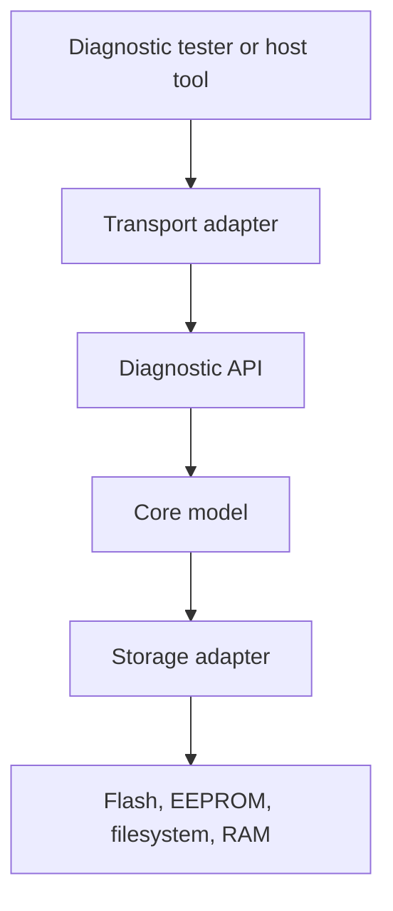

# Design

This branch is the modern C++17 implementation of the diagnostics library. It
shares the product model with the C branch, but it should use C++ idioms where
they make embedded code safer and clearer.

## Purpose

The library gives firmware a small diagnostic core that can be queried from the
outside. A product can expose device identity, diagnostic trouble codes, lifecycle
counters, reset information, and persisted diagnostic records over any transport.
The core does not know whether the bytes travel over CAN, UART, TCP, Modbus, or a
test fixture.

## Design Rules

- No dynamic allocation in library code.
- No exceptions and no RTTI in firmware-facing code.
- Caller-owned memory for all runtime state and buffers.
- Bounded loops only; capacities are explicit.
- Storage writes are explicit or policy-driven, never hidden in hot paths.
- Serialized data uses fixed-width fields, schema versions, lengths, reserved
  bytes, and integrity checks.
- Host tooling owns strings, catalogs, descriptions, and rich product meaning.

## Layer Model

The API layer accepts strongly typed requests and returns `diag::Result` values.
The core owns no transport and performs no hidden I/O. Storage and transport
adapters are supplied by firmware or examples.

## C++ Shape

The C++ implementation should not be a mechanical port of the C code. It should
prefer:

- RAII for lifetime and attach/detach behavior.
- Strong types for diagnostic IDs and product identity.
- `constexpr` constants and compile-time validation.
- Class templates only when they remove runtime configuration or memory cost.
- Explicit result types instead of exceptions.

`diag::ContextStorage` is caller-owned raw storage with **exclusive live
ownership**: exactly one `diag::Context` may be attached to a storage block at a
time, and reusing that storage requires destroying the previous context first.
The current C++ storage bound is 176 bytes on the supported Linux toolchains,
covering the context state, copied storage adapter, and persistence guard state.

The first scaffold establishes this direction with `diag::Context`, fixed
`diag::ContextStorage`, strong IDs, compact `diag::Identity`, volatile DTC
records, lifecycle counters, and a CMake package export.

Feature slices are compile-time switches. The umbrella header exposes only
enabled slices, CMake compiles only enabled source files, and the context state
drops disabled slice fields. This keeps disabled APIs out of downstream firmware
and avoids linking unused capsule or storage code. The narrow module headers
remain useful for direct type declarations, but applications should include
`<diag/diag.hpp>` when they want the configured API surface.

The DTC slice stores records in caller-owned RAM supplied through `diag::Config`.
Registration, lookup, listing, active-state updates, and clear counters are
bounded by the configured capacity. Runtime DTC mutation marks the DTC dirty flag
but performs no storage writes.

The lifecycle slice records the latest reset reason and bounded reset counters in
the context. Policy determines whether the state stays RAM-only or marks the
lifecycle dirty flag for a later explicit persistence step. The core never writes
storage from `observeReset()`.

The capsule slice defines the portable persistent byte format. It writes a
little-endian header and a bounded section table made from fixed-size entries.
Only `sectionCount` entries are encoded, so payloads may begin immediately after
the active table. The decoder validates section bounds and rejects corrupt
capsules with a CRC over all bytes after the header. Separate payload-copy
helpers copy used section bytes into caller-owned buffers. Payload ownership
remains with the caller.

The storage slice binds a context to a caller-owned adapter. The adapter is a
small copied value: callback table, opaque user pointer, storage capabilities, and
a caller-owned capsule staging buffer. Dirty flags decide whether
`savePersistent()` calls the adapter at all. When a save is needed, the function
writes a complete replacement capsule containing every attached persistable
section, so a DTC-only update does not erase a clean lifecycle section or the
reverse. The serialized capsule is padded to the adapter write alignment, and
dirty flags clear only after the save callback succeeds.
Callers must invoke `loadPersistent()` after attaching storage and all relevant
slices, and before any `savePersistent()` call that would write a clean (non-dirty)
section. This ensures previously persisted data is restored into the in-memory
state before it can be overwritten. `savePersistent()` returns `NotInitialized`
when an attached section is clean but `loadPersistent()` has not yet been attempted
with the current storage adapter. Calling `loadPersistent()` on first boot (when no
capsule has been saved yet) is safe and returns `Ok` with nothing to restore.
`loadPersistent()` reads the capsule, validates it, restores known sections, and
leaves unknown section types to future feature slices. `clearPersistent()` simply
delegates to the adapter clear callback. The core still owns no flash, EEPROM,
filesystem, or RTOS behavior.

## Planned Feature Slices

1. Example transports and tester-side tools that prove the API is usable without
   coupling the core to any one protocol.
