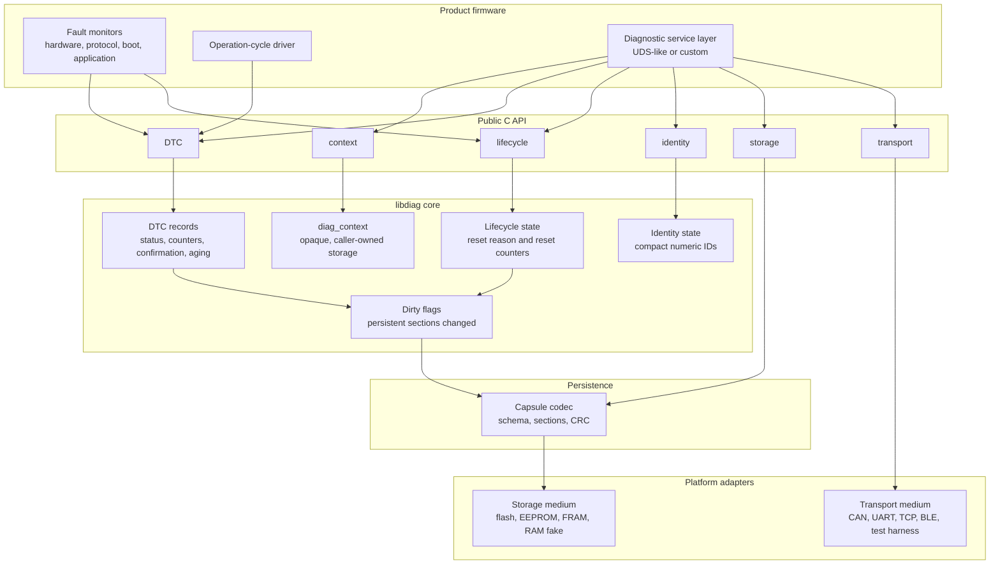
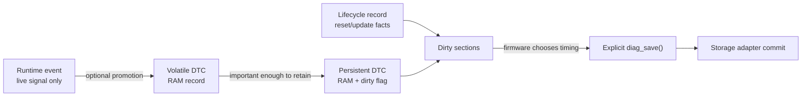
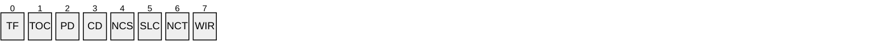
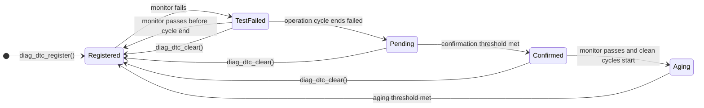
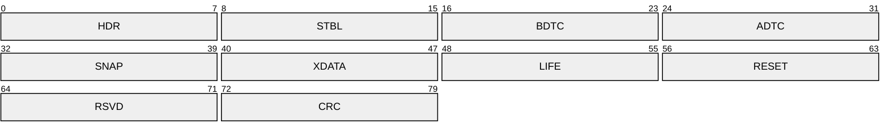
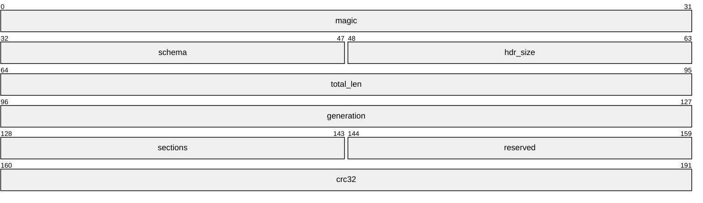
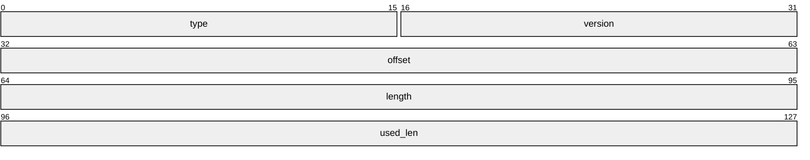
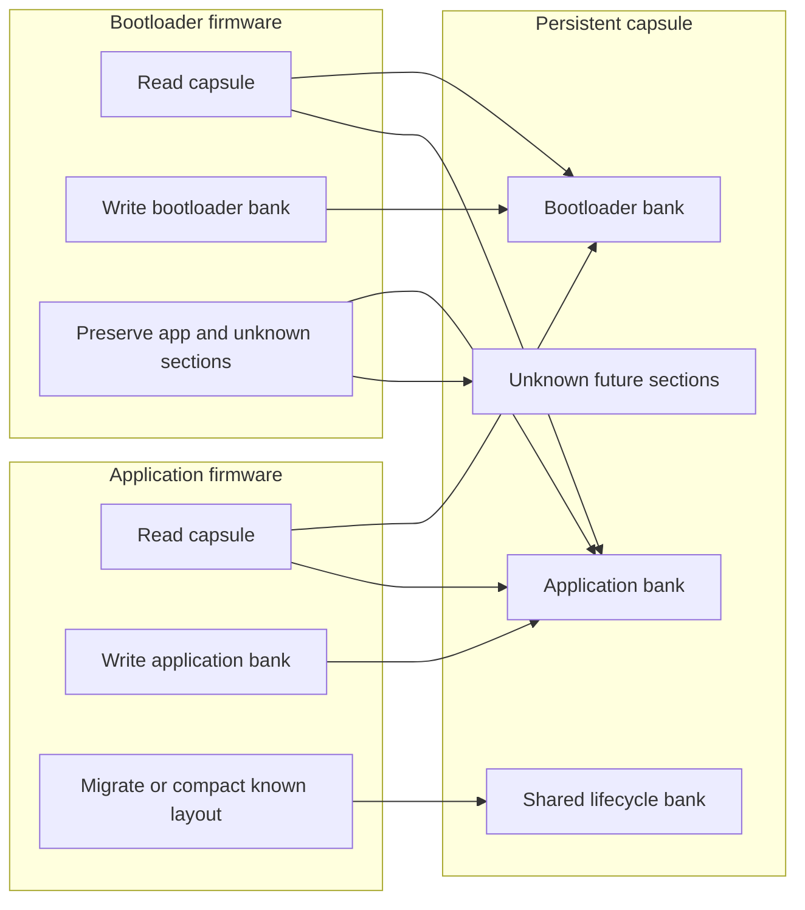
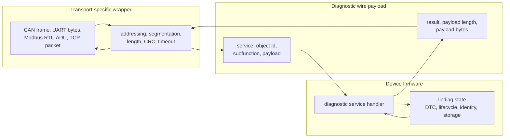
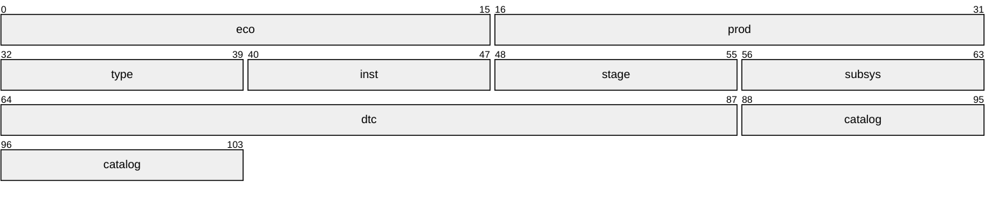

# Diagnostics Library Design

## Purpose

This project provides an embedded-first diagnostics library for firmware that
needs to report, count, clear, and persist device faults. The design is inspired
by UDS DTC concepts, especially the DTC status byte and operation-cycle model,
while keeping the core independent of CAN, ISO-TP, UART, TCP, RTOS APIs, and
storage media.

The library is intended to answer a practical field-service question: when a
device fails, how can an external tool inspect what happened without attaching a
debugger or rebuilding firmware? The failure may be a hardware initialization
error, a runtime peripheral fault, a protocol error, a boot/update issue, a reset
event, or an application state fault. The library gives those failures a common
diagnostic shape.

The design priorities are:

- No heap allocation in core library code.
- Caller-owned memory and explicit capacities.
- No hidden flash writes from hot paths.
- No raw C structure persistence.
- Deterministic loops bounded by configured capacity.
- Compact numeric records on target.
- Host-owned catalogs for names, descriptions, units, and service procedures.

## Architecture Overview

The library is a diagnostic state engine. Product firmware detects faults,
chooses operation-cycle timing, owns protocol parsing, and provides storage and
transport adapters. `libdiag` owns bounded diagnostic state, status transitions,
counters, dirty flags, and capsule serialization.



The ownership boundaries are strict:

- Product firmware owns fault detection, scheduling, protocol parsing, storage
  media, transport media, and wear-leveling policy.
- `libdiag` owns diagnostic state, status transitions, counters, dirty flags, and
  capsule encoding/decoding.
- Host tools own human-readable names, catalogs, descriptions, service actions,
  and product-specific troubleshooting knowledge.

## Branch Strategy

- `main`: intentionally empty or documentation-only.
- `c`: embedded C implementation.
- `cpp`: embedded C++ implementation.

Implementation changes land through PRs into `c` or `cpp`. Protected branches
must not receive direct implementation pushes.

## C API Style

The C branch uses explicit `struct` and `enum` tags in public APIs. Ordinary
structs and enums should not be typedefed only to hide the keyword.

Preferred:

```c
struct diag_context;
enum diag_result diag_save(struct diag_context *ctx);
```

Typedefs are reserved for semantic scalar IDs, callback signatures, and true
platform portability aliases.

Public objects that may evolve should be opaque. For embedded use, opaque
objects still require caller-owned fixed storage. The implementation must not
allocate internal heap memory to create an opaque object.

## Diagnostic Model

Diagnostic state has different lifetimes and storage costs:

| Kind | Lifetime | Storage behavior |
|------|----------|------------------|
| Runtime event | Live only | No persistent state. |
| Volatile DTC | Current boot | Caller-owned RAM; lost on reset. |
| Persistent DTC | Across reset | Stored in the capsule when firmware explicitly saves. |
| Lifecycle record | Across reset by policy | Reset/update facts persisted only by policy. |

Only persistent DTCs and lifecycle records may dirty persistent storage. Runtime
events and volatile DTC updates must remain RAM-only.



Persistent mutations update caller-owned RAM first and set dirty flags in the
context. `diag_get_dirty_flags()` lets firmware decide when to batch, defer, or
skip storage work. `diag_save()` serializes dirty sections into a caller-owned
capsule staging buffer supplied through the storage adapter. A clean
`diag_save()` succeeds without calling the storage adapter.

No DTC or lifecycle hot path may call a storage adapter directly.

### Local Checks And Public DTCs

Internal diagnostic checks and externally visible DTCs are related, but they are
different concepts. A product may have many local checks, monitor points, or
fault paths that map to one visible DTC. The core therefore supports a fixed
`local_fault_id -> dtc_id` mapping table instead of treating the DTC number as
the only internal key.

### UDS Status Byte Mapping

The DTC status byte must be mappable to the UDS `statusOfDTC` byte. The packet
diagram uses compact status acronyms so the bit layout remains readable in
rendered Markdown:



| Bit | Mnemonic | UDS status meaning |
|-----|----------|--------------------|
| 0 | `TF` | `test_failed` |
| 1 | `TOC` | `test_failed_this_operation_cycle` |
| 2 | `PD` | `pending` |
| 3 | `CD` | `confirmed` |
| 4 | `NCS` | `test_not_completed_since_clear` |
| 5 | `SLC` | `test_failed_since_clear` |
| 6 | `NCT` | `test_not_completed_this_operation_cycle` |
| 7 | `WIR` | `warning_indicator_requested` |

Counters saturate instead of wrapping. Repeated `set_active()` on an already
active DTC is idempotent. State transitions are explicit and operation-cycle
driven.



Full-store behavior must be deterministic. A configured store chooses one
overflow policy: reject new entries, replace by priority, or replace by age or
sequence. Cleared records may be erased immediately or retained as bounded
history by policy.

## Storage Capsule

Persistent state is stored as a versioned byte capsule. The capsule is the
compatibility contract across firmware versions and between bootloader and
application. It is never a raw C structure dump.

The first schema uses a fixed header, a bounded section table, and explicit
payload regions.



| Label | Capsule region |
|-------|----------------|
| `HDR` | Header |
| `STBL` | Section table |
| `BDTC` | Bootloader DTC bank |
| `ADTC` | Application DTC bank |
| `SNAP` | Snapshot / freeze-frame records |
| `XDATA` | Extended-data records |
| `LIFE` | Shared lifecycle bank |
| `RESET` | Reset counters |
| `RSVD` | Reserved space |
| `CRC` | CRC / commit marker |

The capsule includes:

- Magic value.
- Schema version.
- Total length.
- Generation counter.
- Section count.
- Per-section type, version, offset, length, and used length.
- Explicit little-endian encoding.
- CRC/integrity check.

Unknown future sections should be skipped or preserved when safe. Unsupported
schema versions fail deterministically. Firmware must not rewrite capsule data
that it cannot understand.

Capsule schema version 1 uses a 24-byte fixed header:



Each section-table entry is 16 bytes:



Snapshot/freeze-frame and extended-data records are fixed-capacity sections. A
DTC stores only compact references to those records. Signal names, units,
scaling, descriptions, and service procedures belong in host catalogs.

Sizing targets:

```text
minimum capsule:      256 bytes
small default:        512 bytes
recommended product:  1024 bytes
persistent DTC:       28 bytes serialized in the C MVP
lifecycle payload:    16 bytes serialized in the C MVP
section count:        <= 8
```

The first C implementation stores DTC records in an explicit little-endian
section and lifecycle/reset counter state in a separate 16-byte little-endian
section with reserved bytes for future expansion.

## Bootloader And Application Sharing

Bootloader and application firmware may both report diagnostics. They may be
compiled differently and updated independently, so persistent storage must be
split by ownership.

Use strict ownership banks:

- Bootloader bank: bootloader writes, application reads.
- Application bank: application writes, bootloader preserves.
- Shared lifecycle bank: explicit policy only.
- Reset counters: policy-driven and wear-aware.

The bootloader should read known fields, write only bootloader-owned state, and
preserve unknown application data. The application can own richer migration,
compaction, and full capsule rebuilds.



Persistent lifecycle records are for durable facts. Immediate handoff state
between bootloader and application should use a separate volatile descriptor in
protected RAM or a platform-owned mailbox. Typical handoff fields include reset
reason, programming request, active medium, protocol/session/security state,
timing values, and warm-response state.

Reset counter persistence must avoid one flash write per boot by default.
Supported policies should include RAM-only, abnormal-reset-only, every-N resets,
platform-provided counters, and adapter-managed wear leveling. After a successful
load, lifecycle counters are restored as clean RAM state; dirty flags are not
persisted.

## Platform Abstraction

The core uses interfaces rather than platform APIs.

Storage adapters own:

- Erase blocks.
- Write alignment.
- Atomic commit.
- Journaling or copy-on-write.
- Wear leveling.
- Power-fail recovery.
- Busy or pending write state.
- Shutdown flush behavior.
- Failure counters and compaction policy.

Transport adapters own:

- CAN, UART, TCP, BLE, SPI, test harnesses, and other media.
- Framing such as ISO-TP, SLIP, COBS, or length-prefix.
- Partial reads and writes.
- Nonblocking behavior and recovery after link errors.

The core and optional protocol handler operate on caller-owned buffers only.
Storage APIs distinguish RAM staging from physical commit. A save request may
return accepted, busy, rejected, failed, or pending depending on the adapter.

## Feature Model

The library is built as a tiny core plus optional feature modules. `diag_init()`
creates the core context in caller-owned storage. Feature modules attach their
own resources afterward:

```c
struct diag_config config = {0};
struct diag_context_storage storage = {0};
struct diag_context *ctx = NULL;

diag_init(&storage, &config, &ctx);
diag_dtc_attach(ctx, &dtc_config);
diag_lifecycle_attach(ctx, &lifecycle_config);
diag_identity_attach(ctx, &identity);
diag_storage_attach(ctx, &storage_adapter);
diag_transport_attach(ctx, &transport_adapter);
```

This keeps `struct diag_config` stable and small. DTC buffers, lifecycle policy,
identity, storage, and transport resources live with the module that uses them.
An all-zero module config may be valid, so attached state is tracked explicitly
in the private context using one `state_flags` bitmask.

Compile-time feature switches remove unused code and private context fields:

```sh
./build.py test -- DIAG_FEATURE_DTC=OFF DIAG_FEATURE_TRANSPORT=OFF
```

All features default on. `#if DIAG_FEATURE_*` is intentionally limited to CMake
source selection, the umbrella header, private context layout, and core
init/deinit of optional slots. Module algorithms and module public headers
should stay ordinary C whenever possible.

## Protocol Boundary

The library owns diagnostic behavior. It does not own the wire protocol. A
product may expose the same DTC, identity, lifecycle, and storage state through
UDS on CAN, a small UART command set, Modbus RTU, TCP, BLE, a bootloader link, or
a manufacturing test harness. Those choices live outside the core.

The diagnostic payload is the stable part. The transport wrapper is allowed to
change from product to product:

```text
transport medium -> link framing -> diagnostic request/response -> diag_* APIs
```



The wrapper is responsible for getting a complete request payload to the
diagnostic handler and returning a complete response payload to the tester. The
core should never need to know whether the bytes arrived through CAN IDs, UART
delimiters, Modbus slave addresses, TCP ports, or a test fixture.

```mermaid
sequenceDiagram
    participant Tool as PC diagnostic tool
    participant Link as Transport wrapper
    participant Handler as Service handler
    participant Core as libdiag core

    Tool->>Link: send framed request
    Link->>Handler: deliver bounded request payload
    Handler->>Core: call diag_* APIs
    Core-->>Handler: state, counters, or result code
    Handler-->>Link: bounded response payload
    Link-->>Tool: send framed response
```

At the service boundary, a future optional request/response handler may look
like this:

```c
enum diag_result diag_protocol_handle_request(
    struct diag_context *ctx,
    const uint8_t *request,
    size_t request_len,
    uint8_t *response,
    size_t response_cap,
    size_t *response_len);
```

That function receives one complete diagnostic request and writes one complete
diagnostic response. It must not assume CAN, UDS negative-response codes,
sessions, security access, inter-frame timing, or transport frame boundaries.

Transport wrappers own these concerns:

- Physical or OS link setup.
- Addressing and routing.
- Frame delimiters, length fields, checksums, CRCs, or ISO-TP segmentation.
- Partial reads and writes.
- Timeouts, retries, duplicate suppression, and stale frame recovery.
- Maximum payload size for that link.
- Threading, polling, interrupt, DMA, or RTOS integration.

Diagnostic service handlers own these concerns:

- Mapping service IDs or commands to `diag_*` API calls.
- Validating request length and arguments before touching output buffers.
- Returning clear protocol-level errors for unsupported service, overflow,
  invalid request, and unavailable feature.
- Keeping all per-request workspace caller-owned and capacity-bounded.

The diagnostic core owns these concerns:

- DTC registration, status bits, counters, confirmation, aging, and clearing.
- Lifecycle state and reset-counter policy.
- Compact device identity.
- Dirty flags and explicit storage save/load behavior.
- Capsule serialization and validation.

This separation lets the same diagnostic session logic run over several links:

| Link style | Wrapper responsibility | Diagnostic payload stays |
|------------|------------------------|--------------------------|
| SocketCAN | CAN IDs, frame splitting, kernel socket setup, `vcan` or real CAN interface. | Same request and response bytes. |
| POSIX serial | Byte-stream framing, length, CRC, PTY or `/dev/tty*` setup. | Same request and response bytes. |
| Modbus RTU | Slave address, function code, byte count, Modbus CRC16, RS-485 timing. | Same request and response bytes. |
| TCP or test harness | Socket lifecycle or in-memory queues. | Same request and response bytes. |

The core is primarily a diagnostic server/state library. Tester/client behavior,
such as sending OBD Mode 03/04 requests to another ECU, belongs in a separate
optional layer. Local DTC clear semantics are separate from protocol clear
request results. Protocol clear/read operations need result states such as
accepted, rejected, timeout, overflow, partial response, invalid response, and
post-clear-still-present.

Multi-step protocol services must use caller-owned service workspace. Hidden
static service state is avoided so multiple diagnostic instances and multiple
transports can coexist.

Every user-facing example that demonstrates diagnostics must include both sides
of the interaction:

- A simulated embedded device side that uses `diag_*` APIs and owns the
  diagnostic state.
- A PC/diagnostic-tester side that sends requests, decodes responses, prints
  useful diagnostic information, and reports errors clearly.

Device-only examples are acceptable only as small API smoke tests, storage policy
checks, or size profiles. They are not sufficient as onboarding examples because
they do not show why an external tool would use the library.

Each paired example should show the complete path: the device records a fault,
the reader discovers identity, the reader queries active or stored DTCs, the
reader clears records when the protocol allows it, and the device reports the
result. This keeps the examples aligned with the reason the library exists:
external tools must be able to inspect firmware failures without private debug
access.

## Ecosystem Identity

A DTC ID is local to the product or firmware that reports it. To identify a
fault across a product family, combine the device identity fields with the local
DTC ID and the catalog version used to interpret it:



| Label | Identity component |
|-------|--------------------|
| `eco` | Ecosystem ID |
| `prod` | Product ID |
| `type` | Device type |
| `inst` | Device instance |
| `stage` | Firmware stage |
| `subsys` | Subsystem |
| `dtc` | Local DTC ID |
| `catalog` | Namespace/catalog version |

Firmware should report compact numeric IDs. The host catalog turns those numbers
into names, descriptions, service procedures, firmware compatibility ranges, and
product-specific troubleshooting.

## Prior-Art Decisions

A review of shipped embedded diagnostic systems confirmed the main boundaries:
transport-agnostic core, storage-agnostic DTC store, host-owned catalogs, and no
dynamic allocation. The review also fixed these design choices.

DTC model:

- DTC identity is a 24-bit number with the standard high-bit group `P/C/B/U`
  (Powertrain/Chassis/Body/Network); host tooling owns names and descriptions.
- Internal checks and fault paths map to visible DTCs through fixed project
  tables; the DTC number is not the only internal key.
- The status byte must map to and from the standard UDS `statusOfDTC` byte plus a
  `statusAvailabilityMask`.
- DTCs carry saturating occurrence and aging counters.
- The DTC transition model is operation-cycle driven.
- A persistent DTC may reference fixed-size snapshot/freeze-frame records and
  fixed-capacity extended-data records.
- The DTC store is reached through a small query port: status-of-DTC,
  extended-data-record, and snapshot.
- Optional readiness or monitor-group state may be exposed for OBD-style queries
  as a bounded query surface.

Transport:

- Framed media use a `{id, flags, len, data}` unit so addressing metadata is
  explicit.
- Stream media may use byte buffers directly.
- CAN/UDS specifics do not enter the core.
- Reassembly and TX buffers are caller-owned and registered into the adapter.
- Oversized input is rejected deterministically.
- ISO-TP timing is injected as configuration: `N_As`, `N_Bs`, `N_Br`, `N_Cs`,
  `N_Cr`, block size, `STmin`, and flow-control wait cap.
- Block size `0` means infinite.
- Data paths are nonblocking: enqueue/dequeue plus a poll pump.
- Rings reject on full.
- Deadlines use wrap-safe arithmetic on an injected monotonic tick.
- Link and bus errors surface through status; the integrator owns recovery.
- Medium arbitration and reservation policy belong to the integrator.

Protocol:

- An optional service layer should use data-driven dispatch:
  `{selector -> handler, allowed session, security level}`.
- Negative response codes belong in a `diag_nrc` enum at the protocol layer.
- UDS, KWP2000, OBD, and custom protocols should be table choices rather than
  compile-time forks.
- Protocol response policy is injected per protocol or medium.
- Negative-response suppression, functional-vs-physical behavior, and
  response-pending rules do not enter `diag_context`.

Explicitly avoided:

- Hidden globals or singletons.
- Dereferencing packed structs from wire or storage bytes.
- Replacing the entire DTC table on each update.
- Protocol-specific `#ifdef` branches through core algorithms.

## Build And CI

Use `build.py` for local, Docker, and CI workflows:

```sh
./build.py all
./build.py all --dtc-capacity 16 --write-alignment 16 --sections dtc,lifecycle
./build.py size
./build.py size --dtc-capacity 16 --write-alignment 16 --sections dtc,lifecycle
./build.py feature-matrix
./build.py test --preset linux-asan
./build.py build -- DIAG_BUILD_EXAMPLES=OFF
docker compose run --rm diagnostics-dev
```

`./build.py all` runs formatting, debug tests, ASAN/UBSAN tests, release library
installation to `build/install/diag`, size reporting, and a generated CMake
package-consumption smoke test.

`./build.py size` builds the release library and prints `.text`, `.rodata`,
`.data`, `.bss`, enabled feature switches, and fixed diagnostic layout
constants. It also estimates caller-owned DTC RAM and minimum capsule staging
bytes from `--dtc-capacity`, `--write-alignment`, and `--sections`.

`./build.py feature-matrix` builds representative core-only, runtime-DTC,
persistent-diagnostics, and full profiles. Each profile runs applicable tests
and examples, prints a release size report, and fails if disabled feature
symbols remain exported from `libdiag.a`.

Generated artifacts must stay under `build/`. CI runs on PRs and pushes
targeting `c` and `cpp`. Protected branches require PR review and passing CI
before merge.

## TDD Expectations

Every feature starts with GoogleTest coverage. Tests are C++ files that include
C headers through `extern "C"` on the `c` branch.

Important coverage areas:

- Null argument handling.
- Fixed capacity limits.
- Duplicate registration.
- No hidden storage writes for runtime or volatile DTCs.
- Persistent mutations mark dirty state only.
- Unsupported schema versions.
- Malformed or oversized capsule input.
- Storage and transport adapter contracts.
- No silent truncation in list/query APIs; APIs must report required count and
  capacity.
- Snapshot and extended-data bounds.
- Malformed record lengths.
- Local clear semantics versus protocol clear result mapping.
- ASAN/UBSAN clean host behavior.
