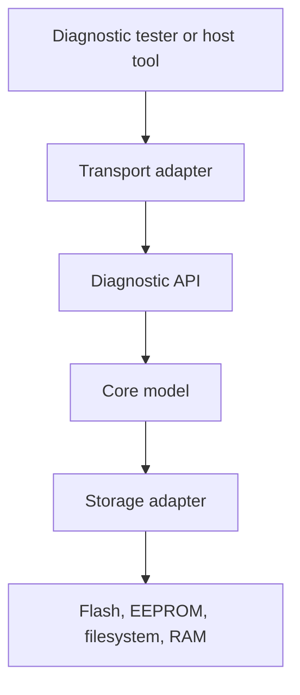

# Design

This branch is the modern C++17 implementation of the diagnostics library. It
shares the product model with the C branch, but it should use C++ idioms where
they make embedded code safer and clearer.

## Purpose

The library gives firmware a small diagnostic core that can be queried from the
outside. A product can expose device identity, diagnostic trouble codes, lifecycle
counters, reset information, and persisted diagnostic records over any transport.
The core does not know whether the bytes travel over CAN, UART, TCP, Modbus, or a
test fixture.

## Design Rules

- No dynamic allocation in library code.
- No exceptions and no RTTI in firmware-facing code.
- Caller-owned memory for all runtime state and buffers.
- Bounded loops only; capacities are explicit.
- Storage writes are explicit or policy-driven, never hidden in hot paths.
- Serialized data uses fixed-width fields, schema versions, lengths, reserved
  bytes, and integrity checks.
- Host tooling owns strings, catalogs, descriptions, and rich product meaning.

## Layer Model

The API layer accepts strongly typed requests and returns `diag::Result` values.
The core owns no transport and performs no hidden I/O. Storage and transport
adapters are supplied by firmware or examples.

## C++ Shape

The C++ implementation should not be a mechanical port of the C code. It should
prefer:

- RAII for lifetime and attach/detach behavior.
- Strong types for diagnostic IDs and product identity.
- `constexpr` constants and compile-time validation.
- Class templates only when they remove runtime configuration or memory cost.
- Explicit result types instead of exceptions.

`diag::ContextStorage` is caller-owned raw storage with **exclusive live
ownership**: exactly one `diag::Context` may be attached to a storage block at a
time, and reusing that storage requires destroying the previous context first.

The first scaffold establishes this direction with `diag::Context`, fixed
`diag::ContextStorage`, strong IDs, compact `diag::Identity`, volatile DTC
records, lifecycle counters, and a CMake package export.

The DTC slice stores records in caller-owned RAM supplied through `diag::Config`.
Registration, lookup, listing, active-state updates, and clear counters are
bounded by the configured capacity. Runtime DTC mutation marks the DTC dirty flag
but performs no storage writes.

The lifecycle slice records the latest reset reason and bounded reset counters in
the context. Policy determines whether the state stays RAM-only or marks the
lifecycle dirty flag for a later explicit persistence step. The core never writes
storage from `observeReset()`.

## Planned Feature Slices

1. Diagnostic capsule serialization for persistent records.
2. Storage integration for explicit save/load/clear operations.
3. Example transports and tester-side tools that prove the API is usable without
   coupling the core to any one protocol.
