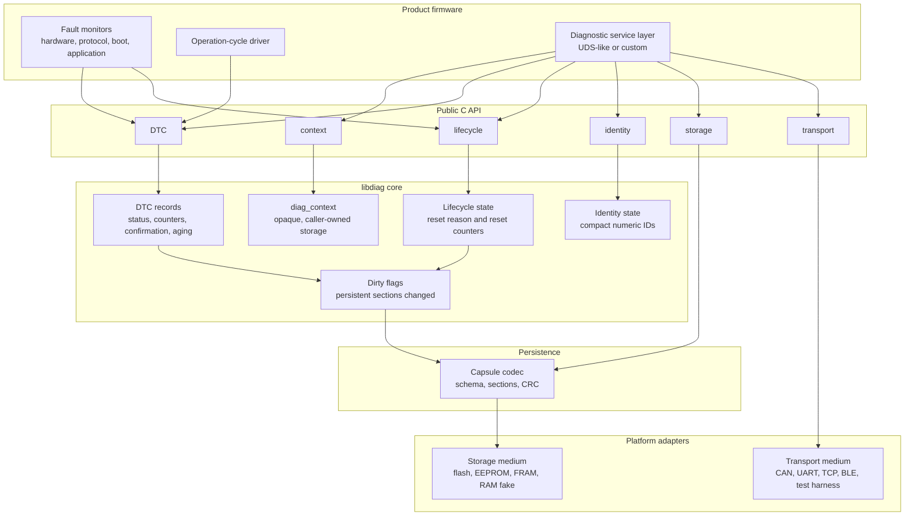
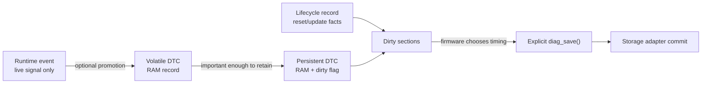
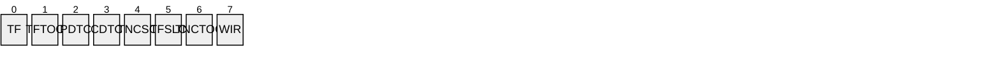
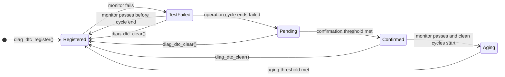
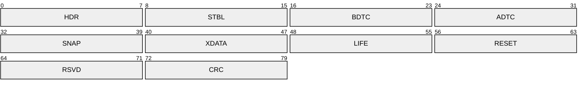
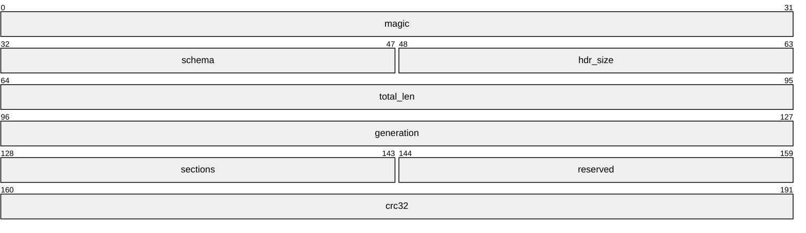
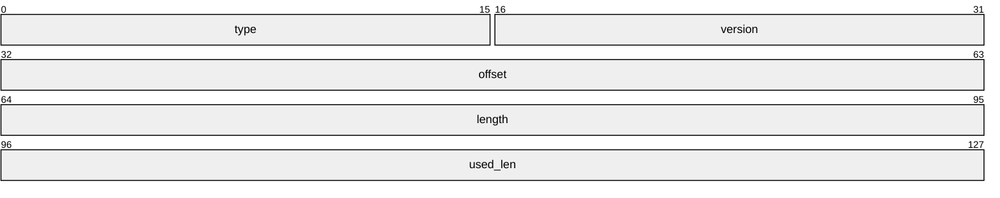
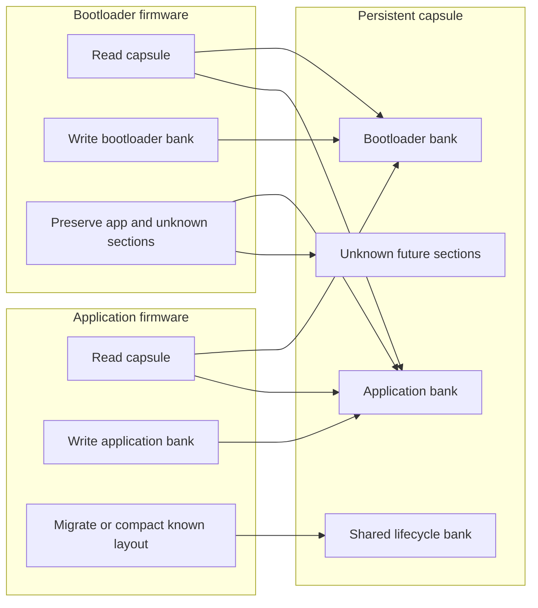
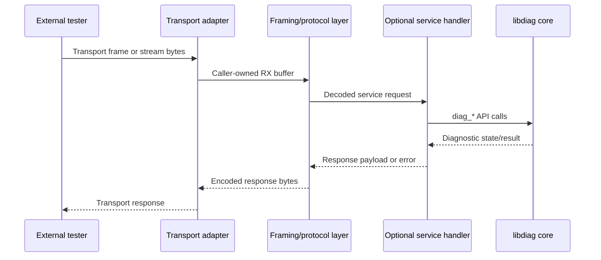
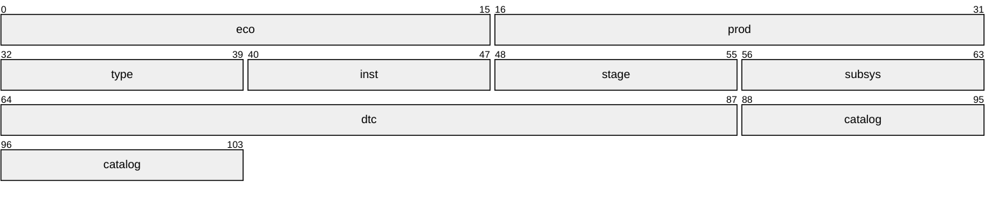

# Diagnostics Library Design

## Purpose

This project builds an embedded-first diagnostics library inspired by UDS DTC
concepts, but not tied to CAN, ISO-TP, UART, TCP, any RTOS, or any storage
medium. The core provides diagnostic APIs; users provide transport, framing, and
storage adapters.

The design optimizes for constrained firmware:

- no heap allocation in core code.
- caller-owned memory and explicit capacities.
- no hidden flash writes.
- no raw C struct persistence.
- deterministic loops bounded by configured capacities.
- compact numeric records on target; rich strings and catalogs belong in host
  tools.

## Architecture Overview

The library is a diagnostic state engine with platform stack concerns kept
outside the core. Product firmware detects faults and owns the external protocol.
`libdiag` keeps bounded diagnostic state and exposes it through public APIs.
Storage and transport are adapters at the edge.



Layer ownership is strict:

- product firmware owns fault detection, operation-cycle timing, protocol parsing,
  storage media, transport media, and wear-leveling policy.
- `libdiag` owns bounded diagnostic state, status transitions, counters, dirty
  flags, and capsule serialization.
- host tools own names, descriptions, service procedures, catalogs, and rich
  product meaning.

## Branch Strategy

- `main`: intentionally empty or docs-only.
- `c`: embedded C implementation.
- `cpp`: embedded C++ implementation.

Implementation must not be pushed directly to protected branches. Changes land
through PRs into `c` or `cpp`.

## C API Style

The C branch uses explicit `struct` and `enum` tags in public APIs. Do not
typedef ordinary structs/enums just to remove the keyword.

Preferred:

```c
struct diag_context;
enum diag_result diag_save(struct diag_context *ctx);
```

Typedefs are acceptable for semantic scalar IDs, callback signatures, or true
platform portability aliases.

Public objects that may evolve should be opaque. For embedded use, opaque
objects must still use caller-owned fixed storage rather than internal heap
allocation.

## Diagnostic Model

Diagnostics are separated by lifetime and storage cost:

- runtime event: no persistent state; useful for live reporting.
- volatile DTC: RAM state for the current boot; lost on reset.
- persistent DTC: stored in the diagnostic capsule; survives reset.
- lifecycle record: boot, reset, update, rollback, and handoff facts.

Only persistent DTCs and lifecycle records may dirty persistent storage.
Runtime and volatile updates must not write flash.



Persistent mutations update caller-owned RAM first and set context dirty flags.
`diag_get_dirty_flags()` exposes those flags so firmware can decide when to
batch, defer, or suppress storage work. Context-level save/load uses a
caller-owned capsule staging buffer supplied through the storage adapter; the
library never allocates this buffer. A clean `diag_save()` is a no-op success.
Supported dirty sections are serialized into the capsule only at explicit
save/load boundaries. A single `diag_save()` may write multiple dirty sections
into one capsule commit. No DTC or lifecycle hot path may call a storage adapter
directly.

Internal diagnostic checks and external DTCs are related but not identical. A
project may have many local checks, monitor points, or fault paths feeding one
visible DTC. The core should therefore support a fixed `local_fault_id -> dtc_id`
mapping table instead of using the DTC number as the only internal key.

The DTC status byte must be mappable to the UDS `statusOfDTC` byte. The packet
diagram uses compact status acronyms so the bit layout stays readable in rendered
Markdown:



| Bit | Mnemonic | UDS status meaning |
|-----|----------|--------------------|
| 0 | `TF` | `test_failed` |
| 1 | `TFTOC` | `test_failed_this_operation_cycle` |
| 2 | `PDTC` | `pending` |
| 3 | `CDTC` | `confirmed` |
| 4 | `TNCSC` | `test_not_completed_since_clear` |
| 5 | `TFSLC` | `test_failed_since_clear` |
| 6 | `TNCTOC` | `test_not_completed_this_operation_cycle` |
| 7 | `WIR` | `warning_indicator_requested` |

Counters should be saturating rather than wrapping. Repeated `set_active()` on an
already active DTC should be idempotent. State transitions are explicit and
operation-cycle driven: `test_failed -> pending -> confirmed -> aged`.



Full-store behavior must be deterministic. Each configured store chooses a policy:
reject new entries, replace by priority, or replace by age/sequence. Cleared records
may be erased immediately or retained as bounded history by policy.

## Storage Capsule

Persistent state is stored as a versioned byte capsule, never as raw C structs.
The first schema should use a fixed header and bounded section table:

```text
header
section table
bootloader DTC bank
application DTC bank
snapshot / freeze-frame records
extended-data records
shared lifecycle bank
reset counters
reserved space
CRC / commit marker
```

The logical capsule envelope is:



| Label | Capsule region |
|-------|----------------|
| `HDR` | Header |
| `STBL` | Section table |
| `BDTC` | Bootloader DTC bank |
| `ADTC` | Application DTC bank |
| `SNAP` | Snapshot / freeze-frame records |
| `XDATA` | Extended-data records |
| `LIFE` | Shared lifecycle bank |
| `RESET` | Reset counters |
| `RSVD` | Reserved space |
| `CRC` | CRC / commit marker |

The capsule includes:

- magic value.
- schema version.
- total length.
- generation counter.
- section count.
- per-section type, version, offset, length, and used length.
- explicit endian encoding.
- CRC/integrity check.

Unknown future sections should be skipped or preserved when safe. Unsupported
schema versions must fail deterministically rather than rewriting data that
cannot be understood.

Capsule schema version 1 uses a 24-byte fixed header:



Each section-table entry is 16 bytes:



Snapshot/freeze-frame and extended-data records are fixed-capacity sections. A DTC
stores only compact references to those records. Signal names, units, scaling,
descriptions, and service procedures belong in host catalogs.

Sizing targets:

```text
minimum capsule:      256 bytes
small default:        512 bytes
recommended product:  1024 bytes
persistent DTC:       28 bytes serialized in the C MVP
lifecycle payload:    16 bytes serialized in the C MVP
section count:        <= 8
```

The first C implementation stores DTC records in an explicit little-endian
section format and lifecycle/reset counter state in a separate 16-byte
little-endian section with reserved bytes for future expansion. Neither section
is a raw C structure dump.

## Bootloader And Application Sharing

Bootloader and application firmware may both report diagnostics. They may be
compiled differently and updated independently, so the persistent capsule is the
compatibility contract.

Use strict ownership banks:

- bootloader bank: bootloader writes, application reads.
- application bank: application writes, bootloader preserves.
- shared lifecycle bank: explicit policy only.
- reset counters: policy-driven and wear-aware.

The bootloader should be conservative: read known fields, write only
bootloader-owned state, and preserve unknown application data. The application
can own richer migration, compaction, and full capsule rebuilds.



Persistent lifecycle records are for durable facts. A separate optional volatile
handoff descriptor should be used for immediate bootloader/application transitions:
reset reason, programming request, active medium, protocol/session/security state,
timing values, and warm-response state. This descriptor lives in protected RAM or a
platform-owned mailbox, not in flash by default.

Reset counter persistence must not imply one flash write per boot by default.
Supported policies should include RAM-only, abnormal-reset-only, every-N resets,
platform-provided counters, and adapter-managed wear leveling. When lifecycle
state is persisted, a successful load restores the counters as clean RAM state;
dirty flags are not themselves persisted.

## Platform Abstraction

The core depends on interfaces, not platforms.

Storage adapters own:

- erase blocks.
- write alignment.
- atomic commit.
- journaling or copy-on-write.
- wear leveling.
- power-fail recovery.
- busy/pending write state.
- shutdown flush behavior.
- failure counters and compaction policy.

Transport adapters own:

- CAN, UART, TCP, BLE, SPI, test harnesses, etc.
- framing such as ISO-TP, SLIP, COBS, or length-prefix.
- partial reads/writes and nonblocking behavior.

The core and optional protocol handler operate on caller-owned buffers only.
Storage APIs should distinguish RAM staging from physical commit. A persistent
mutation marks state dirty; a save request may return accepted, busy, not accepted,
failed, or pending depending on the adapter.

## Feature Model

The library is built as a tiny core plus optional feature modules. `diag_init()`
only creates the core context in caller-owned storage. Feature modules are attached
afterward:

```c
struct diag_config config = {0};
struct diag_context_storage storage = {0};
struct diag_context *ctx = NULL;

diag_init(&storage, &config, &ctx);
diag_dtc_attach(ctx, &dtc_config);
diag_lifecycle_attach(ctx, &lifecycle_config);
diag_identity_attach(ctx, &identity);
diag_storage_attach(ctx, &storage_adapter);
diag_transport_attach(ctx, &transport_adapter);
```

This keeps `struct diag_config` stable and small. DTC buffers, lifecycle policy,
identity, storage, and transport resources live with the module that uses them.
An all-zero module config may be valid, so attached state is tracked explicitly in
the private context using one `state_flags` bitmask.

Compile-time feature switches remove unused code and private context fields:

```sh
./build.py test -- DIAG_FEATURE_DTC=OFF DIAG_FEATURE_TRANSPORT=OFF
```

All features default on. `#if DIAG_FEATURE_*` is intentionally limited to CMake
source selection, the umbrella header, private context layout, and core
init/deinit of optional slots. Module algorithms and module public headers should
stay ordinary C whenever possible.

## Protocol Boundary

The library owns diagnostic behavior. Protocol parsing and framing sit above or
beside it:

```text
transport -> framing -> optional protocol adapter -> diagnostics core
```



A future optional request/response handler may look like:

```c
enum diag_result diag_protocol_handle_request(
    struct diag_context *ctx,
    const uint8_t *request,
    size_t request_len,
    uint8_t *response,
    size_t response_cap,
    size_t *response_len);
```

The handler must not assume CAN, UDS negative response codes, sessions, security
access, or transport frame boundaries.

The core is primarily a diagnostic server/state library. Tester/client behavior
such as sending OBD Mode 03/04 requests to another ECU is a separate optional layer.
Local DTC clear semantics are not the same as protocol clear request results.
Protocol clear/read operations need result states such as accepted, rejected,
timeout, overflow, partial response, invalid response, and post-clear-still-present.

Multi-step protocol services must use caller-owned service workspace. Hidden static
service state is avoided so multiple diagnostic instances and multiple transports
can coexist.

## Ecosystem Identity

A DTC ID is local to the product or firmware that reports it. To identify a
fault across a product family, combine the device identity fields with the local
DTC ID and the catalog version used to interpret it:

```text
ecosystem id
product id
device type
device instance
firmware stage
subsystem
local DTC id
namespace/catalog version
```



| Label | Identity component |
|-------|--------------------|
| `eco` | Ecosystem ID |
| `prod` | Product ID |
| `type` | Device type |
| `inst` | Device instance |
| `stage` | Firmware stage |
| `subsys` | Subsystem |
| `dtc` | Local DTC ID |
| `catalog` | Namespace/catalog version |

Firmware should report compact numeric IDs. The host catalog turns those numbers
into names, descriptions, service procedures, firmware compatibility ranges, and
product-specific troubleshooting.

## Decisions Adopted From Prior-Art Review

A review of prior shipped embedded diagnostic systems confirmed the boundaries
above (transport-agnostic core, storage-agnostic DTC store, host-owned catalogs, no
dynamic allocation) and fixed these specifics for our version.

DTC model (see Diagnostic Model, Ecosystem Identity):

- DTC identity is a 24-bit number with the standard high-bit group `P/C/B/U`
  (Powertrain/Chassis/Body/Network); host tooling owns the names.
- Internal checks/fault paths are mapped to visible DTCs through fixed project
  tables; the DTC number is not the only internal key.
- The status byte must be mappable to/from the standard UDS `statusOfDTC` byte plus
  a `statusAvailabilityMask`, for tester compatibility.
- DTCs carry saturating occurrence/aging counters and an explicit
  `test_failed -> pending -> confirmed -> aged` transition driven by operation
  cycles, not a full table rebuild each cycle.
- A persistent DTC may reference a fixed-size snapshot/freeze-frame record and
  fixed-capacity extended-data records, stored in the capsule.
- The DTC store is reached through a small query port (status-of-DTC,
  extended-data-record, snapshot) so the engine never owns NVM layout.
- Optional readiness/monitor-group state may be exposed for OBD-style queries, but
  it must stay a bounded query surface rather than being baked into DTC storage.

Transport (see Platform Abstraction):

- Framed media use a `{id, flags, len, data}` unit so addressing metadata is
  explicit. Stream media may use byte buffers directly. CAN/UDS specifics never
  enter the core.
- Reassembly/TX buffers are caller-owned and registered into the adapter, never
  allocated; oversize input is rejected deterministically.
- ISO-TP timing is an injected config struct (`N_As/N_Bs/N_Br/N_Cs/N_Cr`, block
  size, STmin, flow-control-wait cap); block size `0` means infinite.
- The data path is non-blocking (enqueue/dequeue plus a poll pump); rings reject on
  full; deadlines use wrap-safe arithmetic on an injected monotonic tick; link/bus
  errors surface via status with integrator-owned recovery and flush-on-reset.
- Medium arbitration and reservation policy belong to the integrator. The core does
  not decide whether CAN, UART, K-line, TCP, or another medium is active.

Protocol (see Protocol Boundary):

- The optional service layer uses data-driven dispatch: a
  `{selector -> handler, allowed session, security level}` table plus a `diag_nrc`
  negative-response-code enum. Protocol (UDS/KWP2000/OBD) is a table choice, never a
  compile-time fork.
- Protocol response policy is injected per protocol/medium. Negative-response
  suppression, functional-vs-physical behavior, and response-pending rules do not
  enter `diag_context`.

Explicitly avoided: hidden globals/singletons; dereferencing packed structs off the
wire (use explicit byte serialization); replacing the whole DTC table on each update
(it destroys counters and history); `#ifdef`-per-protocol.

## Build And CI

Use `build.py` for local, Docker, and CI workflows:

```sh
./build.py all
./build.py all --dtc-capacity 16 --write-alignment 16 --sections dtc,lifecycle
./build.py size
./build.py size --dtc-capacity 16 --write-alignment 16 --sections dtc,lifecycle
./build.py feature-matrix
./build.py test --preset linux-asan
./build.py build -- DIAG_BUILD_EXAMPLES=OFF
docker compose run --rm diagnostics-dev
```

`./build.py all` runs formatting, debug tests, ASAN/UBSAN tests, release library
install to `build/install/diag`, a size/resource report, and a generated CMake
package-consumption smoke test. `./build.py size` builds the release library and
prints `.text`, `.rodata`, `.data`, `.bss`, enabled feature switches, and fixed
diagnostic layout constants. The size command also estimates caller-owned DTC RAM
and minimum capsule staging bytes from `--dtc-capacity`, `--write-alignment`, and
`--sections`; `./build.py all` uses the same options for its final report.
`./build.py feature-matrix` builds representative core-only, runtime-DTC,
persistent-diagnostics, and full profiles. Each profile runs the applicable tests
and examples, prints a release size report, and fails if disabled feature symbols
remain exported from `libdiag.a`. Generated artifacts must stay under `build/`.

CI runs on PRs and pushes targeting `c` and `cpp`. Protected branches require PR
review and passing CI before merge.

## TDD Expectations

Every feature starts with GoogleTest coverage. Tests are C++ files that include
C headers through `extern "C"` on the `c` branch.

Important test areas:

- null argument handling.
- fixed capacity limits.
- duplicate registration.
- no hidden storage writes for runtime/volatile DTCs.
- persistent mutations mark dirty state only.
- unsupported schema versions.
- malformed/oversized capsule input.
- storage/transport adapter contracts.
- no silent truncation in list/query APIs; report required count and capacity.
- snapshot/extended-data bounds and malformed record lengths.
- local clear semantics versus protocol clear result mapping.
- ASAN/UBSAN clean host behavior.
