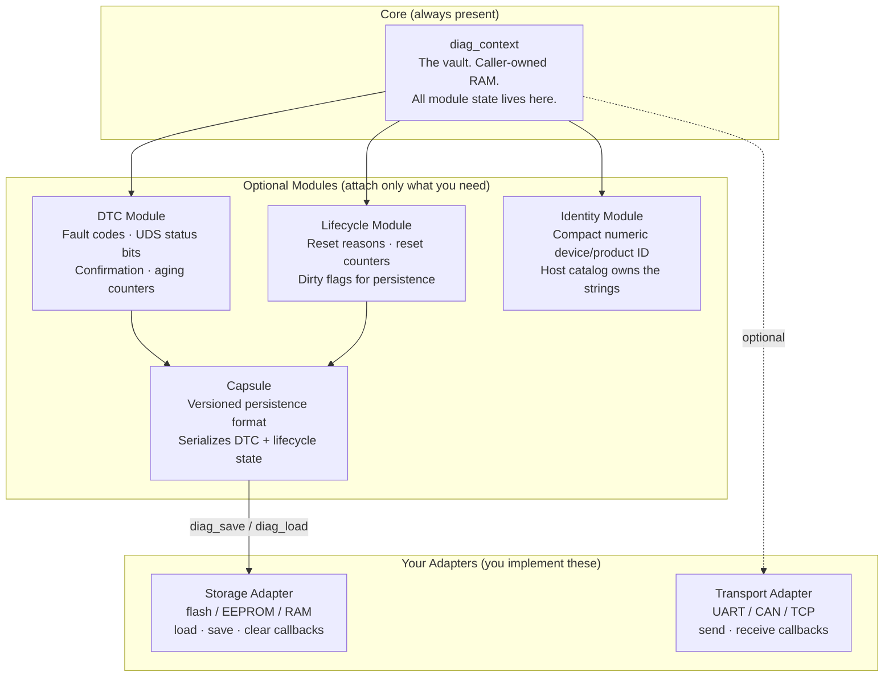
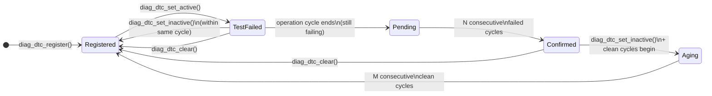

# 5-Minute Onboarding Guide

> _"Part of the journey is the end."_  
> _— Tony Stark. But your firmware shouldn't end because of an untracked fault._

Welcome. You have about five minutes. Let's not waste them.

## What Is This?

**`libdiag`** is a C99 library that tracks **Diagnostic Trouble Codes (DTCs)**,
device **lifecycle/reset events**, and compact **device identity** — without
tying you to any hardware, bus, or RTOS.

It answers the questions your firmware will eventually need to answer:

- _What went wrong, and how many times?_
- _Did it survive the last reset?_
- _Is it confirmed or just pending?_
- _Which device reported it?_

It has **zero platform code**. No CAN. No flash drivers. No RTOS timer. You
bring those; the library brings the state machine.

## The Cast of Characters

Every good team needs a clear org chart:



| Module | What it does | Do you need it? |
|--------|-------------|-----------------|
| `diag_context` | Core state machine — all module slots live here | Always |
| DTC | Tracks fault codes, UDS status bits, occurrence counters | Yes, if you have faults |
| Lifecycle | Reset reasons, saturating reset counters, dirty flags | Yes, if reset history matters |
| Identity | Compact numeric device/product identity | Yes, if devices need to identify themselves |
| Capsule | Serializes DTC + lifecycle into a versioned byte blob | Yes, if persistence is required |
| Storage adapter | Your `load`/`save`/`clear` callbacks for the backing medium | Yes, if using capsule |
| Transport adapter | Your `send`/`receive` callbacks for the diagnostic channel | Yes, if driving a protocol layer |

## What You Provide vs What You Get

This is the contract. Memorize it and you'll be fine.

```mermaid
graph LR
    subgraph Yours["You provide"]
        A["1. Storage adapter\n(3 callbacks: load · save · clear)"]
        B["2. Transport adapter\n(2 callbacks: send · receive)"]
        C["3. Operation cycle driver\n(call diag_dtc_operation_cycle\nat each cycle boundary)"]
        D["4. Caller-owned memory\n(static context + DTC array)"]
    end

    subgraph Lib["Library provides"]
        E["DTC state machine\ntest_failed → pending → confirmed → aged"]
        F["UDS-compatible status byte\n8 defined status bits"]
        G["Saturating counters\noccurrence · active · aging · clear"]
        H["Dirty-flag tracking\nexplicit save/load boundaries"]
        I["Capsule serialization\nversioned · CRC-protected · endian-safe"]
    end

    Yours -->|you wire it up| Lib
```



The key insight: **the library never calls your storage directly on a fault
path**. Faults set dirty flags in RAM. You decide when `diag_save()` is safe
to call — batched, deferred, or on shutdown. No hidden flash writes.

## Your First Integration

Ten lines of setup. That's it.

```c
#include <diag/diag.h>

/* 1. Caller-owned storage — no heap involved */
static struct diag_context_storage ctx_storage;
static struct diag_dtc_snapshot    dtc_records[8];

/* 2. Initialize the core context */
struct diag_context *ctx    = NULL;
struct diag_config   config = {0};
diag_init(&ctx_storage, &config, &ctx);

/* 3. Attach the DTC module with your fixed-capacity record array */
struct diag_dtc_config dtc_cfg = {
    .records  = dtc_records,
    .capacity = 8,
};
diag_dtc_attach(ctx, &dtc_cfg);

/* 4. Register a DTC */
diag_dtc_register(ctx, 0x010001, DIAG_DTC_SEVERITY_ERROR);

/* 5. Set it active when your monitor detects a fault */
diag_dtc_set_active(ctx, 0x010001);

/* 6. Call this once per operation cycle — your timing, not ours */
diag_dtc_operation_cycle(ctx);

/* 7. Clean up (clears runtime state; does not write storage) */
diag_deinit(ctx);
```

Run this with the `basic` or `sensor_node` example as a starting point:

```sh
git clone https://github.com/Mrunmoy/diagnostics.git
cd diagnostics
git checkout c
./build.py build -- DIAG_FEATURE_DTC=ON DIAG_FEATURE_IDENTITY=ON \
  DIAG_FEATURE_LIFECYCLE=OFF DIAG_FEATURE_STORAGE=OFF \
  DIAG_FEATURE_TRANSPORT=OFF DIAG_FEATURE_CAPSULE=OFF

./build/linux-debug/examples/diag_sensor_node_example
# → sensor_node: active runtime DTC 0x010001
```

## The DTC Lifecycle

A DTC is not just a flag. It travels a defined path driven by operation cycles.
The library handles every transition — you just drive the cycle and report
pass/fail:



- **N** (confirmation) defaults to `1` cycle. Set via `diag_dtc_config.confirmation_threshold`.
- **M** (aging) defaults to `40` cycles. Set via `diag_dtc_config.aging_threshold`.
- All counters saturate — they never wrap.
- Calling `set_active()` on an already-active DTC is idempotent (except for status latches).

## Adding Persistence (4 More Steps)

Persistence is opt-in. When you're ready:

```c
/* 1. Provide a staging buffer for the capsule (caller-owned) */
static uint8_t capsule_buf[512];

/* 2. Wire up your storage adapter */
static const struct diag_storage_ops my_ops = {
    .load  = my_flash_load,   /* (user, buf, cap, *bytes_read) */
    .save  = my_flash_save,   /* (user, buf, size)             */
    .clear = my_flash_clear,  /* (user)                        */
};

struct diag_storage my_storage = {
    .ops              = &my_ops,
    .user             = &my_flash_state,
    .capsule_buffer      = capsule_buf,
    .capsule_buffer_size = sizeof(capsule_buf),
    .capabilities = {
        .erase_value     = 0xFF,
        .write_alignment = 4,
    },
};

/* 3. Attach it */
diag_storage_attach(ctx, &my_storage);

/* 4. Load previous state at startup */
diag_load(ctx);

/* ... run your application ... */

/* 5. Save when dirty (you decide when; the library never does this for you) */
uint32_t dirty = 0;
diag_get_dirty_flags(ctx, &dirty);
if (dirty) {
    diag_save(ctx);
}
```

See `examples/adapters/` for concrete RAM and stub callback implementations
you can copy and adapt to your platform.

## Picking Your Feature Profile

Only pay for what you use. Compile-time feature switches remove unused code and
private context fields:

| I need… | Example to follow | Features |
|---------|-------------------|----------|
| Just prove the library links cleanly | `basic` | all OFF |
| Runtime faults, no persistence | `sensor_node` | DTC + identity |
| Identity + transport hook only | `io_module` | identity + transport |
| Runtime faults + lifecycle tracking | `dtc` + `lifecycle` | DTC + lifecycle |
| Confirmed process faults with persistence | `process_controller` | DTC + lifecycle + storage + capsule |
| Critical faults + lifecycle persistence | `industrial_oven` | DTC + lifecycle + identity + storage + capsule |
| Separate bootloader / application banks | `bootloader_app_shared` | DTC + lifecycle + storage + capsule |
| Full ECU — everything | `ecu_node` | all ON |

```sh
# Build and run a specific profile (example: full ECU node)
./build.py build -- \
  DIAG_FEATURE_DTC=ON \
  DIAG_FEATURE_LIFECYCLE=ON \
  DIAG_FEATURE_IDENTITY=ON \
  DIAG_FEATURE_STORAGE=ON \
  DIAG_FEATURE_TRANSPORT=ON \
  DIAG_FEATURE_CAPSULE=ON

./build/linux-debug/examples/diag_ecu_node_example
# → ecu_node: confirmed DTC 0x050001, saved <n> bytes
```

## API Entry Points — Where to Start

Read these in order:

| Step | Header | Key functions |
|------|--------|---------------|
| 1. Init | `diag/context.h` | `diag_init()`, `diag_deinit()`, `diag_get_dirty_flags()` |
| 2. DTC module | `diag/dtc.h` | `diag_dtc_attach()`, `diag_dtc_register()` |
| 3. Drive monitors | `diag/dtc.h` | `diag_dtc_set_active()`, `diag_dtc_set_inactive()` |
| 4. Advance cycles | `diag/dtc.h` | `diag_dtc_operation_cycle()` |
| 5. Query state | `diag/dtc.h` | `diag_dtc_get()`, `diag_dtc_get_status()`, `diag_dtc_list()` |
| 6. Lifecycle | `diag/lifecycle.h` | `diag_lifecycle_attach()`, `diag_lifecycle_observe_reset()` |
| 7. Identity | `diag/identity.h` | `diag_identity_attach()`, `diag_identity_get()` |
| 8. Persistence | `diag/storage.h` | `diag_storage_attach()`, `diag_save()`, `diag_load()` |
| 9. Transport | `diag/transport.h` | `diag_transport_attach()` |

Include `<diag/diag.h>` to pull in everything, or include individual headers
when a module only needs one surface.

## Glossary

| Term | Plain-English meaning |
|------|-----------------------|
| **DTC** | Diagnostic Trouble Code — a numeric fault ID with a UDS-compatible 8-bit status byte |
| **Operation cycle** | One meaningful runtime interval you define (e.g. power-on to power-off). You call `diag_dtc_operation_cycle()` at the boundary; the library advances counters and state. |
| **Confirmation threshold** | Number of consecutive failed operation cycles before a DTC is marked `CONFIRMED`. |
| **Aging threshold** | Number of consecutive clean operation cycles before a confirmed DTC ages back to clear. |
| **Capsule** | The versioned, CRC-protected byte blob the library serializes DTC and lifecycle state into. The library owns the format; you own the storage medium. |
| **Dirty flag** | An in-RAM signal that persistent state has changed. Dirty state is only written to storage when you call `diag_save()`. |
| **Adapter** | Your callback table that the library calls for storage or transport. You implement three functions (`load`/`save`/`clear`) or two (`send`/`receive`); the library calls them at explicit boundaries. |
| **Context** | The opaque `struct diag_context` — the library's runtime home. You allocate `struct diag_context_storage` statically; the library lives inside it. |
| **UDS** | Unified Diagnostic Services (ISO 14229). The DTC status byte format is compatible with UDS, but the library has no UDS protocol code. Your protocol layer sits above or beside `libdiag`. |
| **Caller-owned memory** | The library never calls `malloc`. You declare all arrays and buffers statically (or on the stack). The library receives pointers and writes into your memory. |

## Going Deeper

| Resource | What you'll find |
|----------|-----------------|
| [`docs/design.md`](design.md) | Full architecture: capsule format, storage contract, protocol boundary, TDD expectations |
| `include/diag/` | Public API headers — every function is documented inline |
| `examples/` | One directory per profile with build commands and expected output |
| `tests/` | GoogleTest suite — read these to understand exact behavior contracts |
| `./build.py all` | Full local gate: format, tests, ASAN, release install, size report |
